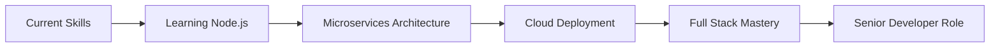

<div align="center">

<!-- Dynamic Typing SVG -->


---

### 💫 Passionate Developer | 🎯 Hackathon Winner | 🚀 Innovation Enthusiast

[](https://github.com/AbhiteshGiri)
[](https://github.com/AbhiteshGiri)
[](https://github.com/AbhiteshGiri)

</div>

---

## 🎯 About Me

```javascript
const abhitesh = {
    role: "Full Stack Developer",
    location: "India 🇮🇳",
    currentFocus: "Building scalable web applications",
    lifePhilosophy: "Code with passion, build with purpose",
    
    currentProjects: {
        main: "Lok Seva Dost (Care Services Platform)",
        sideProject: "Premium Jewellery E-commerce",
        learning: "Advanced Node.js & Microservices"
    },
    
    lookingFor: {
        collaboration: "Resume Builder Platform",
        help: "Performance & SEO Optimization",
        opportunities: "Full-time Software Engineering Roles"
    },
    
    achievements: [
        "🏆 Multiple Hackathon Winner",
        "⭐ Open Source Contributor",
        "🎓 Continuous Learner"
    ]
};
```

<div align="center">

### 💬 **Ask me about:** Web Development | Data Structures | Full Stack Architecture

### 📧 **Contact:** [abhiteshgiri325@gmail.com](mailto:abhiteshgiri325@gmail.com)

### 😄 **Pronouns:** He/Him

</div>

---

## 🚀 Premium Projects

<div align="center">

### Featured Work

<table>
<tr>
<td width="50%">

<h3 align="center">💎 Shiv Shakti Jewellers</h3>

<div align="center">  
<a href="https://github.com/AbhiteshGiri/Jewels-Website">

</a>
</div>

**Tech Stack:**
- Node.js, Express, MongoDB
- JWT Auth, OTP Verification
- Multer File Uploads
- WhatsApp Integration

</td>
<td width="50%">

<h3 align="center">🏥 Apna Assistant</h3>

<div align="center">
<a href="https://github.com/AbhiteshGiri/Apna-Assistant">

</a>
</div>

**Tech Stack:**
- Full Stack Web App
- Care Services Platform
- Real-time Notifications
- Admin Dashboard

</td>
</tr>

<tr>
<td width="50%">

<h3 align="center">🚗 E-Park Gateway</h3>

<div align="center">
<a href="https://github.com/AbhiteshGiri/E-Park-Gateway">

</a>
</div>

**Tech Stack:**
- Smart Parking Management
- Real-time Slot Tracking
- Payment Integration
- User Dashboard

</td>
<td width="50%">

<h3 align="center">🌐 Portfolio Website</h3>

<div align="center">
<a href="https://github.com/AbhiteshGiri/portfolio">

</a>
</div>

**Tech Stack:**
- HTML, CSS, JavaScript
- Responsive Design
- Smooth Animations
- Contact Integration

</td>
</tr>
</table>

</div>

---

## 🛠️ Tech Stack & Skills

<div align="center">

### 🎨 Frontend Development


### ⚙️ Backend Development


### 🔧 Tools & Technologies


### 📊 Data Structures & Algorithms


</div>

---

## 📊 GitHub Statistics

<div align="center">


</div>

---

## 🏆 GitHub Trophies

<div align="center">


</div>

---

## 💼 Professional Experience

<div align="center">

| Role | Organization | Duration | Key Achievements |
|:----:|:------------:|:--------:|:-----------------|
| 🚀 **Full Stack Developer** | Freelance | 2023 - Present | • Built 10+ production-ready web applications<br>• Achieved 95%+ client satisfaction rate |
| 🎓 **Open Source Contributor** | GitHub | 2022 - Present | • Contributed to multiple repositories<br>• Maintained active coding streak |
| 🏆 **Hackathon Winner** | Various Events | 2021 - 2024 | • Won multiple hackathons<br>• Built innovative solutions under pressure |

</div>

---

## 🎯 Current Focus & Goals

<div align="center">



### 🌱 Currently Learning
- Advanced Node.js & Express patterns
- Microservices architecture
- Performance optimization techniques
- SEO best practices

### 🎓 2025 Goals
- [ ] Master cloud deployment (AWS/Azure)
- [ ] Contribute to major open-source projects
- [ ] Build SaaS product
- [ ] Achieve 1000+ GitHub stars
- [ ] Write technical blogs

</div>

---

## 📫 Connect With Me

<div align="center">

### Let's Build Something Amazing Together! 🚀

<a href="https://www.linkedin.com/in/abhitesh-giri-3924a3245/">
  
</a>
<a href="https://github.com/AbhiteshGiri/Portfolio">
  
</a>
<a href="mailto:abhiteshgiri325@gmail.com">
  
</a>
<a href="https://twitter.com/abhiteshgiri">
  
</a>

</div>

---

## 💡 Random Dev Quote

<div align="center">


</div>

---

## 🐍 Contribution Snake

<div align="center">


</div>

---

<div align="center">

### 💖 Thanks for visiting my profile! 

### ⭐ If you like my work, please give a star to my repositories!


**📊 Profile Analytics:**


---

**💎 "Code is like humor. When you have to explain it, it's bad." - Cory House**

© 2025 Abhitesh Giri. All Rights Reserved.

</div>
